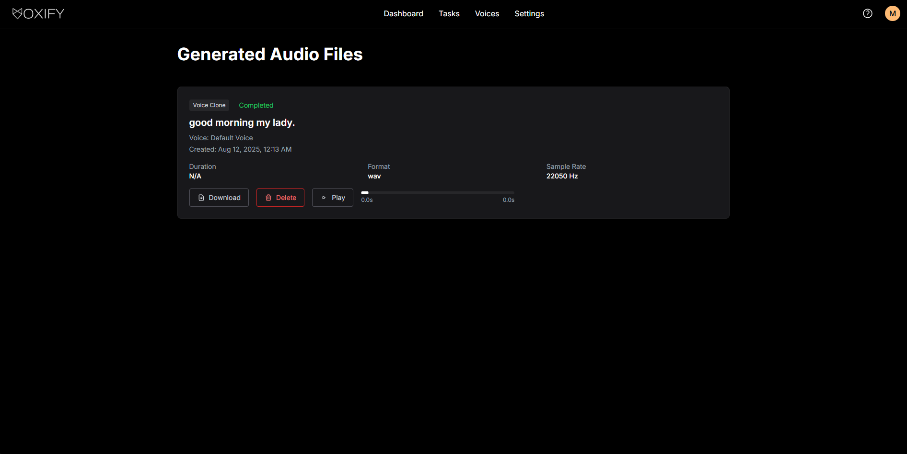

# Hi new developer, welcome to Voxify!

<p align="center">

</p>

Voxify is an AI-powered voice cloning and text-to-speech platform that enables users to create personalized synthetic voices from audio samples. The application leverages cutting-edge diffusion transformer technology (F5-TTS) to generate high-quality, natural-sounding speech by capturing tone, rhythm, and accent of different voices.

---

# Overview

Voxify's core capabilities consist of voice sample processing, embedding generation, real-time synthesis, and precise timing control for natural speech patterns.

**Context & Value:** Voice cloning technology addresses the growing demand for personalized audio content across multiple industries. Traditional TTS systems produce generic, robotic voices that lack emotional nuance and personal connection. Voxify solves this by making voice synthesis technology more accessible through a user-friendly API while maintaining enterprise-grade security and performance standards.

The platform's value lies in its ability to capture human vocal identity digitally, thereby enabling content creators, businesses, and individuals to scale personalized audio production without sacrificing authenticity or quality.

---

## Key Use Cases

This project hopes to aid primarily in **content creation and media production**, **business and enterprise applications**, **accessibility and assistive technology**, and **personal and creative applications**. Creators and producers can create high-quality voiceovers, create multiple characters for storytelling, or produce content in their own voice when physically unavailable, all while ensuring consistency in quality. Organizations can enhance their customer experience and streamline communication processes by maintaining consistent service for customer support, marketing messages, or executive communications.

Beyond professional use, Voxify enables personal expression and memory preservation with voice manipulation, character creation, and other settings to preserve loved ones' voices or create fictional voices for creative expression. Additionally, accessibility needs can also be met by providing individuals with speech impairments or language barriers the opportunity to recreate their original voice in speech for their original language or others while preserving vocal identity.

## Key Features

**Voice Cloning and Synthesis:**

- Upload audio samples to create personalized voice models.
- Generate natural-sounding speech from any text input using cloned voices.

**User Management and Security:**

- Secure user authentication and profile management.
- Job status tracking for synthesis requests.

**Technical Infrastructure:**

- RESTful API architecture for easy integration.
- Dual database system and CI/CD pipeline for automated testing and quality assurance.

**AI-Powered Processing:**

- F5-TTS diffusion transformation technology, with fine-tuning options for improved voice quality.
- Model versioning and management capabilities.

---

# Getting Started

**Frontend Production Link:** https://voxify-prod.vercel.app

**Frontend Preview Link:** https://voxify-dev.vercel.app

**Backend Service Link:** https://milaniez-montagy.duckdns.org/

--- 

Here is our landing Page, where users can find related information of our platform:
<p align="center">
  
</p>

Users can create an account and log in. Once they do so, they will be redirected to the user dashboard.

<p align="center">


</p>

The dashboard has access to cloning your voice and the text-to-speech option, as well as statistics of your current voice clones and completed/processed tasks while the audio samples are recording. There is also a set of quick actions where users can view their tasks and profile settings.

<p align="center">

</p>

Users can clone their voice using a `.wav` audio sample of their own voice. A 10-second audio file is recommened. Once you name the voice, write a description, and include the reference text of what was said in the audio sample, it will be saved to your account. Users can also record their own voices directly on our website.

<p align="center">

</p>
<p align="center">

</p>


The text-to-speech page allows users to input any text they want converted to audio using either a voice clone or the system voice(s). The user can also change the language spoken. English and Mandarin are recommended, as the other model requires further training.

<p align="center">

</p>

Generated audio recordings are saved in the "Tasks" tab, and users can then download/play/delete previously generated sound recordings.

<p align="center">

</p>

<details>
<summary><b>Accessibility Widget (for AI Assignment)</b></summary>
There is an accessibility widget in the bottom right corner that allows users to customize their view to better suit individual needs.

<p align="center">

</p>

The customizable options include adhering to accessibility profiles, content adjustments, color adjustments, and orientation adjustments.

<p align="center">


</p>

</details>

---
# API service and fast start locally
Here are some key API endpoints for our backend. For more reference please check backend.ApiDoc.md.
Authentication & Profile
- POST /api/v1/auth/register – Register a new user
- POST /api/v1/auth/login – Log in and receive JWT token
- GET /api/v1/auth/profile – Get current user profile
- PUT /api/v1/auth/profile – Update user profile

Voice Sample Management
- POST /api/v1/voice/samples – Upload a voice sample (WAV/MP3)
- GET /api/v1/voice/samples – List uploaded samples
- DELETE /api/v1/voice/samples/{sample_id} – Delete a sample

Voice Clone Management
- POST /api/v1/voice/clones – Create a voice clone from sample IDs
- GET /api/v1/voice/clones – List voice clones
- POST /api/v1/voice/clones/{clone_id}/synthesize – Synthesize using a clone

Synthesis Job Management
- POST /api/v1/job – Create a new synthesis job
- GET /api/v1/job/{job_id}/progress – Track job progress in real-time
- GET /api/v1/file/synthesis/{job_id} – Download synthesized audio

We have've configured **Swagger** to test our backend locally, pls following these command:
- cd backend
- pip install -r requirements.txt
- python start.py
- Then open http://localhost:8000/docs/

Suggested test flows using Swagger or Postman:

- **Create users**:
Post:/auth/register -> Post:/auth/login -> Set Bear <token> using token returned from previous step

- **Create voice clone**:
Post:/voice/samples -> Post:/voice/clones -> Post:/voice/clones/{clone_id}/select -> Post:/voice/clones/{clone_id}/synthesize

- **Download synthesized audio file**:
Get:/file/synthesis/{job_id}


## Overall Structure

graph TB
    %% External Services & Users
    User[👤 User] 
    Vercel[🌐 Vercel Frontend<br/>Production: voxify-prod.vercel.app<br/>Preview: voxify-dev.vercel.app]
    HomeServer[🖥️ Partner Home Server<br/>Backend: milaniez-montagy.duckdns.org]
    F5TTS[🤖 F5-TTS AI Service<br/>Voice Synthesis Engine]
    
    %% Frontend Layer
    subgraph "Frontend Layer - React 18.2.0"
        React[📱 React Frontend<br/>Port: 3000]
        
        subgraph "Frontend Components"
            Pages[📄 Pages<br/>Dashboard, VoiceClone,<br/>TextToSpeech, Voices,<br/>Tasks, Settings]
            Components[🧩 Components<br/>Navbar, VoiceRecorder,<br/>TabSelector, LoadingSpinner]
            Services[⚙️ Services<br/>API, Auth, Job,<br/>Language, VoiceClone]
        end
        
        TailwindCSS[🎨 Styling<br/>Tailwind CSS + Material UI]
    end
    
    %% API Gateway & Load Balancer
    Nginx[🔄 Nginx Reverse Proxy<br/>Load Balancer & SSL]
    
    %% Backend Layer
    subgraph "Backend Layer - Flask + Python"
        FlaskAPI[🌐 Flask API Server<br/>Port: 8000<br/>RESTful Architecture]
        
        subgraph "API Modules"
            AuthAPI[🔐 Authentication API<br/>/api/v1/auth/*<br/>JWT Token Management]
            VoiceAPI[🎤 Voice API<br/>/api/v1/voice/*<br/>Samples, Clones, Synthesis]
            FileAPI[📁 File Management API<br/>/api/v1/file/*<br/>Upload/Download]
            JobAPI[⚡ Job Management API<br/>/api/v1/job/*<br/>Progress Tracking]
        end
        
        subgraph "Core Services"
            F5TTSService[🎯 F5-TTS Service<br/>Voice Processing<br/>Multilingual Support]
            EmailService[📧 Email Service<br/>SMTP Integration]
            AuthService[🛡️ Auth Service<br/>Password Management]
        end
    end
    
    %% Database Layer
    subgraph "Database Layer"
        SQLite[(🗄️ SQLite Database<br/>User Profiles<br/>Voice Metadata<br/>Authentication Data)]
        ChromaDB[(🧠 ChromaDB Vector Database<br/>Voice Embeddings<br/>Similarity Search)]
    end
    
    %% AI Processing Layer
    subgraph "AI Processing Layer"
        F5TTSEngine[🤖 F5-TTS Engine<br/>Diffusion Transformers<br/>Voice Synthesis]
        EmbeddingEngine[🎯 Embedding Generator<br/>Voice Feature Extraction]
        ModelManager[📦 Model Manager<br/>Version Control<br/>Fine-tuning]
    end
    
    %% Infrastructure Layer
    subgraph "Infrastructure & DevOps"
        Docker[🐳 Docker Containers<br/>Multi-service Orchestration]
        DockerCompose[🔧 Docker Compose<br/>Service Management]
        
        subgraph "CI/CD Pipeline"
            GitHub[📂 GitHub Repository<br/>Version Control]
            GitHubActions[⚡ GitHub Actions<br/>Automated Testing<br/>Linting & Formatting]
            Testing[🧪 Testing Suite<br/>Backend: pytest 512 tests<br/>Frontend: Jest 250 tests]
        end
        
        subgraph "Monitoring & Security"
            HealthCheck[💚 Health Monitoring<br/>/health endpoint]
            Snyk[🔒 Snyk Security<br/>Vulnerability Scanning]
            Logging[📊 Logging System<br/>Container Logs]
        end
    end
    
    %% Connections
    User -->|HTTPS| Vercel
    User -->|API Calls| HomeServer
    Vercel -->|Deploy| React
    HomeServer -->|Host| Nginx
    
    Nginx --> FlaskAPI
    React --> AuthAPI
    React --> VoiceAPI
    React --> FileAPI
    React --> JobAPI
    
    AuthAPI --> AuthService
    AuthAPI --> SQLite
    VoiceAPI --> F5TTSService
    VoiceAPI --> ChromaDB
    FileAPI --> SQLite
    JobAPI --> SQLite
    
    F5TTSService --> F5TTS
    F5TTSService --> F5TTSEngine
    F5TTSService --> EmbeddingEngine
    EmbeddingEngine --> ChromaDB
    
    AuthService --> EmailService
    
    FlaskAPI --> Docker
    React --> Docker
    Docker --> DockerCompose
    
    GitHub --> GitHubActions
    GitHubActions --> Testing
    GitHubActions --> Snyk
    
    FlaskAPI --> HealthCheck
    Docker --> Logging
    
    %% Language Support Flow
    VoiceAPI -.->|Multilingual Support| F5TTSEngine
    F5TTSEngine -.->|Native: zh-CN, en-US<br/>Specialized: ja-JP, fr-FR<br/>Fallback: ko-KR, pt-BR| ModelManager
    
    %% Styling with black text
    classDef userLayer fill:#e1f5fe,stroke:#01579b,stroke-width:2px,color:#000000
    classDef frontendLayer fill:#f3e5f5,stroke:#4a148c,stroke-width:2px,color:#000000
    classDef backendLayer fill:#e8f5e8,stroke:#1b5e20,stroke-width:2px,color:#000000
    classDef databaseLayer fill:#fff3e0,stroke:#e65100,stroke-width:2px,color:#000000
    classDef aiLayer fill:#fce4ec,stroke:#880e4f,stroke-width:2px,color:#000000
    classDef infraLayer fill:#f1f8e9,stroke:#33691e,stroke-width:2px,color:#000000
    classDef externalLayer fill:#e0f2f1,stroke:#004d40,stroke-width:2px,color:#000000
    
    class User,Vercel,HomeServer,F5TTS externalLayer
    class React,Pages,Components,Services,TailwindCSS frontendLayer
    class FlaskAPI,AuthAPI,VoiceAPI,FileAPI,JobAPI,F5TTSService,EmailService,AuthService backendLayer
    class SQLite,ChromaDB databaseLayer
    class F5TTSEngine,EmbeddingEngine,ModelManager aiLayer
    class Docker,DockerCompose,GitHub,GitHubActions,Testing,HealthCheck,Snyk,Logging infraLayer
    class Nginx backendLayer

## Backend Structure

Voxify utilises a RESTful API structure. It uses Python and Flask with capabilities for the following:

- User authentication and management
- Voice sample upload and processing
- Voice clone generation and selection
- Text-to-speech synthesis with syllable-to-time or word-to-time mapping
- Synthesis job status monitoring
- Rate limiting and usage tracking

## Frontend Structure

The project uses a React-based frontend with Material UI and Tailwind.
Core Framework:
- React 18.2.0 - Modern React framework using functional components and Hooks
- React Router DOM 6.21.3 - Client-side routing management
- Material UI 5.15.6 - Material Design component library 1
- Tailwind CSS 3.4.1 - Utility-first CSS framework
Additional Dependencies:
- Axios 1.6.7 - HTTP client for API communication
- Emotion - CSS-in-JS solution (Material UI dependency)

## Databases

Voxify uses two databases - a relational database for user management and storage of voice samples, and a vector database for storing voice embeddings.

- SQLite is used to store user profiles, authentication data, and metadata, as well as their uploaded voices.
- ChromaDB is used for storing and querying voice embeddings, each with metadata linking it back to corresponding users or tasks.

## AI Components

The AI functionality of Voxify uses voice synthesis models used for text-to-speech (TTS) generation. We are currently using F5-TTS, which is an open-source TTS synthesis tool using diffusion transformers.

- Voice embeddings are extracted for personalized cloning.
- There will be fine-tuning capabiltiies for improved voice quality.
- Real-time processing is used for immediate feedback.

## Containerization

Docker is used for containerization:

- Docker Compose allows for multiple services to be run and compiled from individual Dockerfiles. A Dockerfile is used across subdirectories for corresponding containers in to be built based on their requirements/dependencies.
- Containers are orchestrated to make local development and testing easy to conduct.
- Integrations with the CI/CD pipeline are integrated for automated builds and testing. Using GitHub Actions, formatting/linting, as well as tests for end-to-end API calls are tested to ensure branch merges do not affect existing test cases and the project is successful.

---

# Deployment

The backend of this project is deployed onto our partner's home computing server that we have privileges to SSH into. It is served via Waitress (WGSI server).
All code is pulled from the GitHub repository, and is built and run using the orchestrated Docker Compose services.

The F5-TTS AI service is also run from the partner's server with a minimum dedicated GPU memory allocation for the service.

The frontend is deployed using Vercel, which takes directly from a GitHub repository. It allows for multiple environments and deployments for preview/development (based on pull requests) and production.

## Running Locally

**Prerequisites:**
- [Docker](https://www.docker.com/)
- [Docker Compose](https://docs.docker.com/compose/)

**Environment Secrets:**

Most of the environment secrets are configured in the `docker-compose.yml` file, however, if required, look at the `.env.example` example below. You will also need a `.env.prod` if trying to deploy to production.

```
DATABASE_URL=sqlite:///data/voxify.db
FRONTEND_URL=localhost:3000
VECTOR_DB_PATH=data/chroma_db
JWT_SECRET_KEY=Majick
SECRET_KEY=Majick
SMTP_FROM_EMAIL=voxifynoreply@gmail.com
SMTP_FROM_NAME=Voxify
SMTP_HOST=smtp.gmail.com
SMTP_PASSWORD=uhxxrskdlliidcyg
SMTP_PORT=587
SMTP_USERNAME=voxifynoreply@gmail.com
SMTP_USE_TLS=true
```

**Local Setup:**

Clone the repository and launch the full stack:
```
git clone https://github.com/csc301-2025-y/project-2-Voxify.git
cd Voxify
make dev
```
Services started:
| Services | Description | URL |
| -------- | ----------- | --- |
| `frontend` | React App (CRA) | http://localhost:3000 |
| `api` | Flask backend API | http://localhost:8000 |
| `db-init` | One-time DB initialization script | N/a|

You can check the backend health using `curl http://localhost:8000/health`.

Additional commands for local testing and deployment can be found using `make help`.

<details>
<summary><i>Click here to see all Makefile targets.</i></summary>
<code>Available targets:
 install         - Install all dependencies
 lint            - Run linting for backend and frontend
 reformat        - Format code for backend and frontend
Testing:
 test            - Run all tests (backend + frontend + security)
 test-backend    - Run only backend tests
 test-frontend   - Run only frontend tests
 test-security   - Run security tests with Snyk
 test-quick      - Run backend tests without full rebuild
Building:
 build           - Build all Docker images
 build-backend   - Build only backend services
 build-frontend  - Build only frontend service
 db-build        - Build database container
Running:
 up              - Start backend services only
 up-full         - Start all services (backend + frontend)
 up-backend      - Alias for 'up' (backend only)
 down            - Stop all services
 frontend        - Start frontend development server locally
Development:
 dev             - Install, lint, build, and start backend services
 logs            - Show logs from running services
 shell           - Open shell in backend container
 clean           - Clean up Docker resources
Production:
 setup-certs     - Setup SSL certificates for Docker
 setup-nginx     - Setup nginx configuration
 prod-build      - Build production images
 prod-up         - Start production services
 prod-down       - Stop production services
 prod-deploy     - Full production setup
 prod-status     - Check production status
 prod-logs       - Show production logs
</code>
</details>

## Testing

Testing is conducted using pytest for the backend using comprehensive fixtures and mocking for the backend.

The frontend uses Jest with React Testing Library for unit and integration testing.

**Running Tests:**

```
make test  # Runs all tests
make test-backend  # Runs only backend tests 
make test-frontend  # Runs only frontend tests
make test-quick  # Runs backend tests without a full rebuild
```

### Backend Testing

Tests are conducted in layers with the following:
- **Unit Tests** - Core logic, utilities, file and audio processing.
- **Service/API Tests** - Full REST API endpoints using Flask test client and `curl`.
- **Integration Tests** - End-to-end workflows across auth, voice, cloning, synthesis, job queues.
- **Performance Tests** - Audio upload, clone generation, TTS response times.
- **Security Tests** - Input validation, path traversal, SQL injecion prevention.

More generally, authentication, voice processing, database, jobs, files, error handling, and external services, were the key areas covered while integrating the project's testing structure.

**Coverage Overview (for D3):**
- **Total Test Cases:** 512
- **Pass Rate:** 96.9% (496 passed, 16 skipped)
- **Coverage:** 85% overall (8985/10,326 lines)
- **High-Coverage Models:** database models, authentication logic, embedding services, error handling
- **Low-Coverage Models:** voice clone APIs, modal integration

**Tools Used:**
- `pytest`
- `pytest-cov` for coverage reporting
- SQLite for isolated test databases
- `psutil` for performance and resource monitoring

### Frontend Testing

Voxify was not initially planned to have a frontend, and tests were not as rigorous as our backend API.

A global test setup is defined in `frontend/src/setupTests.js` to ensure compatability with the React environment. Tests live alongside components using the `.test.js` extension.

For D3, frontend test coverage reached 42% line coverage in 250 tests. For D4, coverage reached to 81% over about 500 tests; see coverage report below.

```
------------------------|---------|----------|---------|---------|----------------------------------------
File                    | % Stmts | % Branch | % Funcs | % Lines | Uncovered Line #s                      
------------------------|---------|----------|---------|---------|----------------------------------------
All files               |   79.95 |    77.83 |   81.72 |   80.54 |                                        
 src                    |       0 |        0 |       0 |       0 |                                        
  App.js                |       0 |        0 |       0 |       0 | 23-45                                  
  index.js              |       0 |      100 |     100 |       0 | 6-7                                    
 src/components         |     100 |     87.5 |     100 |     100 |                                        
  Navbar.js             |     100 |     87.5 |     100 |     100 | 15,124                                 
 src/config             |     100 |    66.66 |     100 |     100 |                                        
  api.config.js         |     100 |       75 |     100 |     100 | 6-22                                   
  languages.js          |     100 |     62.5 |     100 |     100 | 170-171,195-275                        
 src/pages              |   77.28 |    76.26 |   78.26 |   78.35 |                                        
  Dashboard.js          |     100 |      100 |     100 |     100 |                                        
  ForgotPassword.js     |     100 |      100 |     100 |     100 |                                        
  HelpPage.js           |     100 |      100 |     100 |     100 |                                        
  Login.js              |     100 |      100 |     100 |     100 |                                        
  Register.js           |     100 |      100 |     100 |     100 |                                        
  ResetPassword.js      |    96.2 |    97.91 |     100 |    96.2 | 87-89                                  
  Settings.js           |     100 |    94.44 |     100 |     100 | 25                                     
  Tasks.js              |   45.08 |    45.97 |      45 |   45.83 | ...165-172,182,186-188,229-232,331-408 
  TextToSpeech.js       |   50.43 |    55.07 |   51.85 |   53.27 | ...105-107,111-128,149-153,280,349-397 
  VoiceClone.js         |   85.18 |       80 |   93.75 |   85.89 | 72-73,83-84,88-89,93-94,117-118,247    
  Voices.js             |     100 |    97.05 |     100 |     100 | 35                                     
 src/services           |   85.24 |    85.09 |   86.36 |   84.87 |                                        
  api.js                |   22.58 |    21.42 |      20 |   22.58 | 16-29,35-68                            
  auth.service.js       |      80 |    71.11 |      80 |   79.66 | 142-186                                
  job.service.js        |     100 |      100 |     100 |     100 |                                        
  language.service.js   |     100 |      100 |     100 |     100 |                                        
  voiceClone.service.js |     100 |      100 |     100 |     100 |                                        
------------------------|---------|----------|---------|---------|----------------------------------------
```
**Testing Setup Inclusions:**
- `@testing-library/jest-dom` for extended matchers like `.toBeInTheDocument()`.
- Mocks for browser APIs unavailable in Jest by default:
    - `ResizeObserver`
    - `IntersectionObserver`
    - `matchMedia`
    - `localStorage`
    - `URL.createObjectURL`
    - `HTMLAudioElement`
- Global `fetch` and `alert` mocks.
- Suppressess `console.error` noise during test runs.

### Linting
Linting and formatting checks are done automatically whenever a push is made onto a GitHub branch. The following are checked:
- **Backend** - Black, Flake8
- **Frontend** -  ESLint, Prettier

**Running Lint Checks:**
```
make lint  # For both frontend and backend
make reformat  # Reformats the code for linting
```

## Maintenance

### Dependency Management
Dependencies for the backend are managed in the `requirements.txt` and `requirements-dev.txt`. To update packages:
```
pip list --outdated
pip install --upgrade <package>
```

Frontend dependencies are managed via `npm`. To check and update:
```
npm outdated
npm update
```

Whenever code or dependencies are changed, be sure to end/down all services using `make down` and rebuild using `make build`.

You can also clear stale volumes or containers using `docker system prune -a --volumes`, but note that this will stop all containers and unused volumes/images.

For production (when SSH'ing onto the server), please do the following to deploy new changes:
```
cd Voxify
git pull
sudo make prod-down
sudo make prod-deploy
```

### Logs and Monitoring

Container logs can be checked using `make logs` and a shell for the backend container is opened through `make shell`. The backend health endpoint is at http://localhost:8000/health.

### Cleanup and Refactoring

Periodically prune unused Docker resources and remove deprecated components and dead code. Also keep documentation and comments up-to-date when updating APIs or architecture.

Dependabot (via GitHub) and linting will typically check for many of these dependency and security-related issues that come with deprecated packages and libraries.

---

# Project Task Management

 **GitHub Projects** and **GitHub Issues** are used to plan, track, and manage our development tasks, and the project boards will serve as the central hub for any work-related activities. 
 
 Progress is checked and tasks are assigned each week during our weekly standups with our partner. Status of the project is also updated regularly and during the sync meetings.

## GitHub Workflow Overview

- **Sprints -** We are operating on a 1-week sprint-based development, where each member is assigned a task to complete for that week. New tasks are added based on our goals and requirements for upcoming milestones, and they may carryover from previous sprints depending on the progress made.
- **Tasks & Issues -** Each task is created as a GitHub issue and is linked to the project board. We assign each task to the member and include the necessary milestones and labels to it. Any development-related tasks also get linked to a new branch beginning with `pr/[ISSUE]`.
- **Labels -** All tasks are labelled based on different types, as a feature, bug, enhcancement, or documentation, as well as a start-to-end date to ensure that all members understand what is being worked on.
- **Project boards -** Columns are divided as "To Do", "In Progress", "Done", where each task gets moved along to reflect current progress. There is also a "Backburner" column for any features that may be considered later on in development but are not a priority.
- **Automation -** GitHub automation is used using CI/CD workflows, ensuring that all issues and pull requests can be synced with the board status and do not have any problems before being pushed to the main branch.

---

# Partner Information:

**Mehdi Zeinali** 

*Engineer of Computer Vision, Network Security and Embedded Solutions*

📧: mehdi@zeina.li  

☎️️: 778-952-3223  


---

# License

**Propietary Software License Agreement**

Copyright (c) 2025 Majick
All rights reserved.

This Proprietary Software License Agreement (the “Agreement”) governs the use of the software, source code, documentation, and other files contained in the private GitHub repository “Voxify” (the “Software”), owned by Mehdi Zeinali.

**1. Grant of License -**
You are granted a limited, non-exclusive, non-transferable, revocable license to access and use the Software solely for internal business purposes as authorized by Mehdi Zeinali. This license applies only while you have authorized access to the private GitHub repository.

**2. Restrictions -**
Without prior written consent from Mehdi Zeinali, you may NOT:
- Share, fork, clone, copy, or distribute the repository or any part of its contents to any unauthorized party;
- Use the Software for any commercial purpose outside the scope of authorization;
- Modify, adapt, translate, reverse engineer, decompile, disassemble, or create derivative works based on the Software;
- Remove or alter any copyright, trademark, or proprietary notices.

**3. Ownership -**
All intellectual property rights in and to the Software remain the exclusive property of Mehdi Zeinali. Access to the private GitHub repository does not convey any ownership or open-source licensing rights.

**4. Confidentiality -**
The Software and all related materials are proprietary and confidential. You agree to protect the confidentiality of the Software and not disclose any portion to unauthorized individuals or entities.

**5. Term and Termination -**
This Agreement is effective from the date you are granted access to the repository and will terminate automatically if you violate any terms. Upon termination, you must immediately stop using the Software, delete all local copies, and remove any forks or clones.

**6. Disclaimer of Warranties -**
The Software is provided "as is", without warranties of any kind, express or implied, including but not limited to warranties of merchantability, fitness for a particular purpose, or non-infringement.

**7. Limitation of Liability -**
In no event shall Mehdi Zeinali be liable for any indirect, incidental, consequential, special, or punitive damages, even if advised of the possibility of such damages. Liability shall not exceed the amount paid (if any) for the Software.
