# Hi new user, welcome to Voxify!

Voxify is an AI-powered voice cloning and text-to-speech platform that enables users to create personalized synthetic voices from audio samples. The application leverages cutting-edge diffusion transformer technology (F5-TTS) to generate high-quality, natural-sounding speech by capturing tone, rhythm, and accent of different voices.

---

# Overview

Voxify's core capabilities consist of voice sample processing, embedding generation, real-time synthesis, and precise timing control for natural speech patterns.

**Context & Value:** Voice cloning technology addresses the growing demand for personalized audio content across multiple industries. Traditional TTS systems produce generic, robotic voices that lack emotional nuance and personal connection. Voxify solves this by making voice synthesis technology more accessible through a user-friendly API while maintaining enterprise-grade security and performance standards.

The platform's value lies in its ability to capture human vocal identity digitally, thereby enabling content creators, businesses, and individuals to scale personalized audio production without sacrificing authenticity or quality.

---
## ✨ Features

### 1. Account Management & Authorization
- Secure account registration, storage, and authentication.  
- Users can recover their accounts via email if they forget their credentials.

### 2. Voice Model Building
- Upload your own voice recordings or record directly on our website to create a personalized voice model.

### 3. Voice Cloning
- Generate speech content using your custom voice model.  
- Choose the output language for the generated voice.

### 4. Task Management
- View all your generated speech tasks in the task dashboard.  
- Easily download, delete, or play the audio files.
---
## ✨ Installation

> **No installation required**, VoiceClone runs in your browser.  
> Visit our website: **[https://voxify-prod.vercel.app](https://voxify-prod.vercel.app)**
---

## ✨ How to Use

1. **Sign Up / Log In**  
At our landing page, Click get started to create a account or click log in to your existing account.

  

  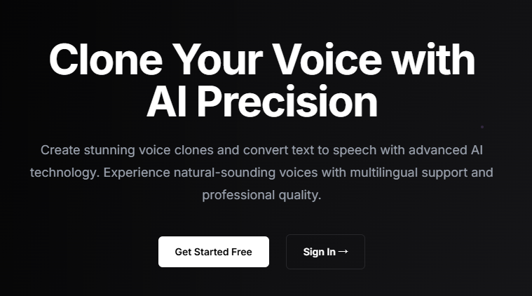
  

  This is our sign-up page. Please note that you need to enter a valid password and an email address that has never been used before.

   

  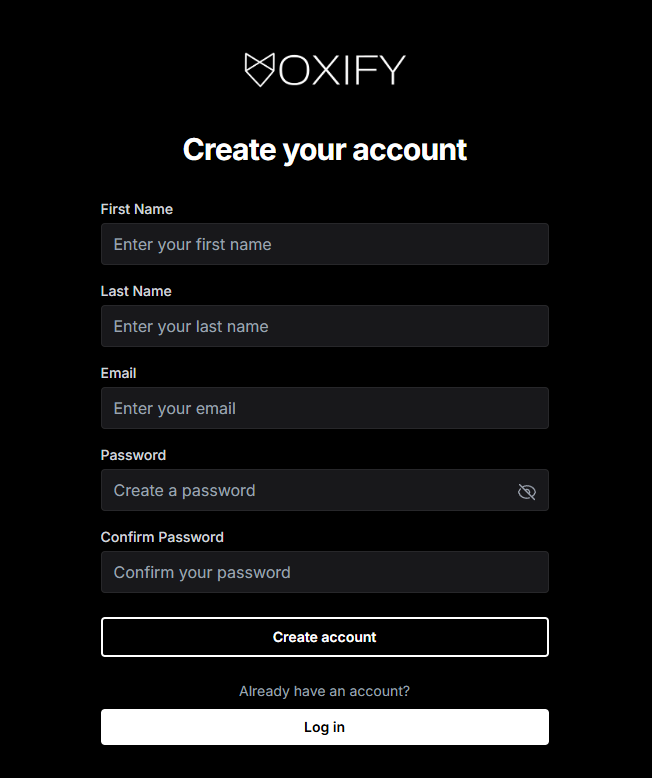
  

  Or directly log in. If you don't remember your password, no worries! Click **"Forgot your password"** to reset it.

   

  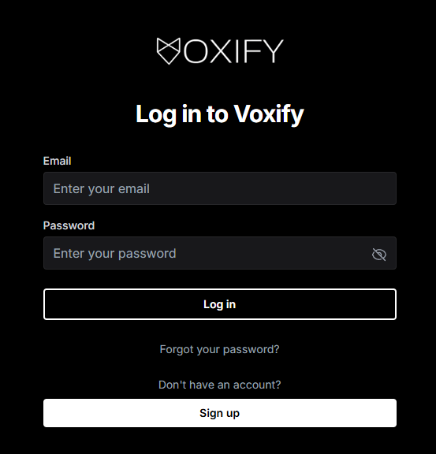
  

  

  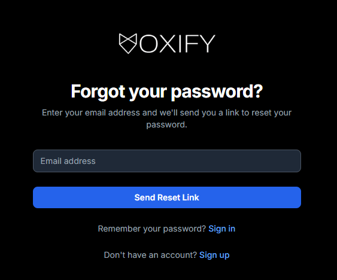
  

The reset email will be send to your email! Click the embeded link to reset password.

  

  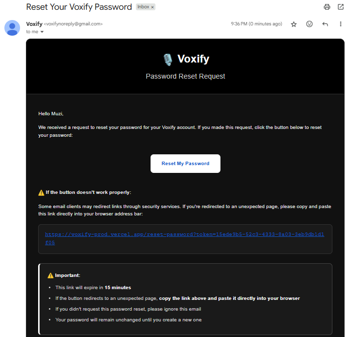
  

2. **Build Your Voice Model**  
After logging in, you will be navigated to the dashboard. Click **"Clone your voice"** to start uploading your voice sample.

  

  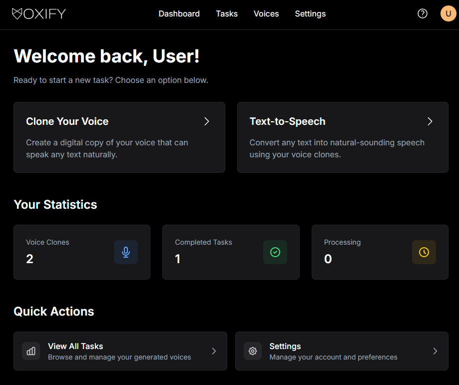
  

You may choose to upload your existing voice file (should be in **.wav** format). Please enter the correct reference text for the content of the sample.

  

  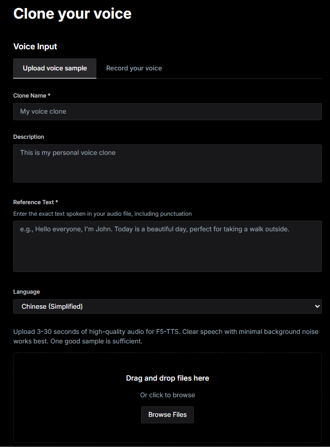
  

Or choose to **record your own sample** on our website. Read the sentence we provide and click **Generate Voice Clone**. 

**Notice**: Please choose the language as **Chinese** or **English**, since we are still improving models for other languages.

  

  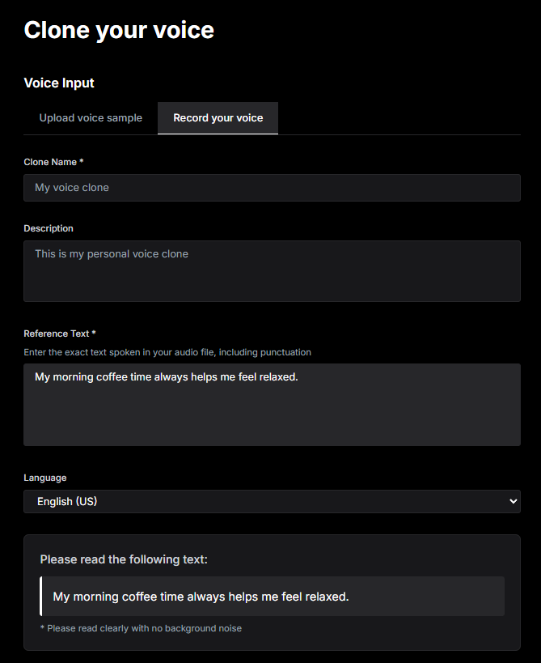
  

3. **Generate Speech**  

At the dashboard page, click **Text-To-Speech**. Select the **voice clone** you created and the **language** you want to try. 
**Recommended**: Choose **English** or **Chinese**, as the quality for other languages might not be as good at the moment.

  

  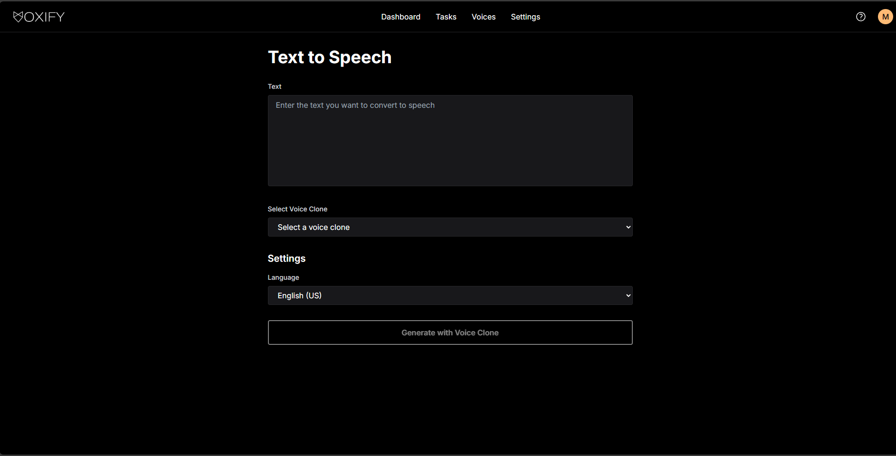
  

4. **Manage Your Tasks**  

 Click **Tasks** to access your voice clone tasks. From here, you can:
- Download generated audio.
- Delete unwanted files.
- Play audio directly.

  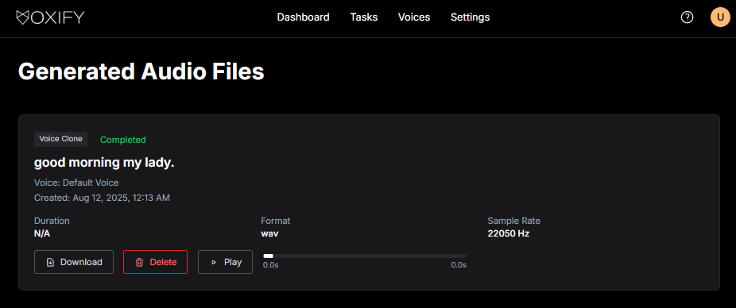

  Click **Voices** to see all the voice samples you have uploaded.

  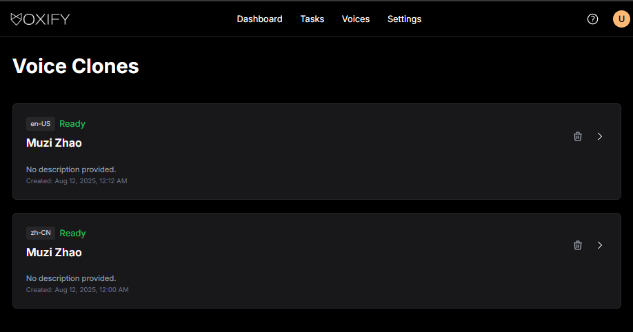

5. **Settings**  
 The settings is accessible through the top right tool bar. Here, you can change your email and your first and last name. For changing your password, see part 1.

  

---

## ✨ FAQ

**Q:** Is my voice data safe?  
**A:** Yes. All data is securely stored and can be deleted at any time.

**Q:** Can I clone any voice?  
**A:** Only voices you have permission to use. Using others' voices without consent may violate laws.

**Q:** Why can’t I upload my voice sample?  
**A:** Our system includes a duplicate voice sample detection feature. This means you may already have uploaded the same voice sample before. Try clearing your existing voice list or uploading a completely new voice sample.

**Q:** The quality of my generated voice clone audio is not good, why?  
**A:** This may be because the reference text you used for your voice sample was not suitable. Try using a different voice sample to improve the quality of the generated audio.

**Q:** I can’t create a voice clone, what’s wrong?  
**A:** Make sure you clicked the **Generate Voice Clone** button at the bottom of the page after selecting your voice sample and settings.

**Q:** How long does it take to create a voice clone?  
**A:** For shorter text inputs, the process usually takes less than 30 seconds.

---

## ✨ License

**Propietary Software License Agreement**

Copyright (c) 2025 Majick

All rights reserved.

This Proprietary Software License Agreement (the “Agreement”) governs the use of the software, source code, documentation, and other files contained in the private GitHub repository “Voxify” (the “Software”), owned by Mehdi Zeinali.

**1. Grant of License -**
You are granted a limited, non-exclusive, non-transferable, revocable license to access and use the Software solely for internal business purposes as authorized by Mehdi Zeinali. This license applies only while you have authorized access to the private GitHub repository.

**2. Restrictions -**
Without prior written consent from Mehdi Zeinali, you may NOT:
- Share, fork, clone, copy, or distribute the repository or any part of its contents to any unauthorized party;
- Use the Software for any commercial purpose outside the scope of authorization;
- Modify, adapt, translate, reverse engineer, decompile, disassemble, or create derivative works based on the Software;
- Remove or alter any copyright, trademark, or proprietary notices.

**3. Ownership -**
All intellectual property rights in and to the Software remain the exclusive property of Mehdi Zeinali. Access to the private GitHub repository does not convey any ownership or open-source licensing rights.

**4. Confidentiality -**
The Software and all related materials are proprietary and confidential. You agree to protect the confidentiality of the Software and not disclose any portion to unauthorized individuals or entities.

**5. Term and Termination -**
This Agreement is effective from the date you are granted access to the repository and will terminate automatically if you violate any terms. Upon termination, you must immediately stop using the Software, delete all local copies, and remove any forks or clones.

**6. Disclaimer of Warranties -**
The Software is provided "as is", without warranties of any kind, express or implied, including but not limited to warranties of merchantability, fitness for a particular purpose, or non-infringement.

**7. Limitation of Liability -**
In no event shall Mehdi Zeinali be liable for any indirect, incidental, consequential, special, or punitive damages, even if advised of the possibility of such damages. Liability shall not exceed the amount paid (if any) for the Software.

---

## ✨Contact：

Email: voxifys0@gmail.com

---

