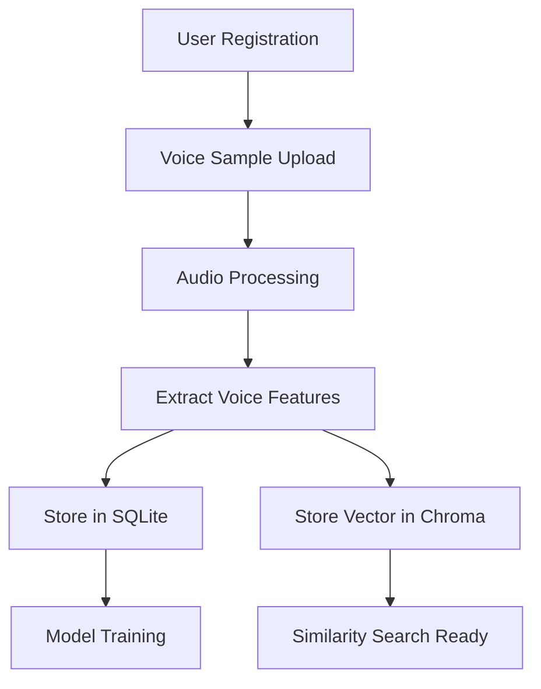
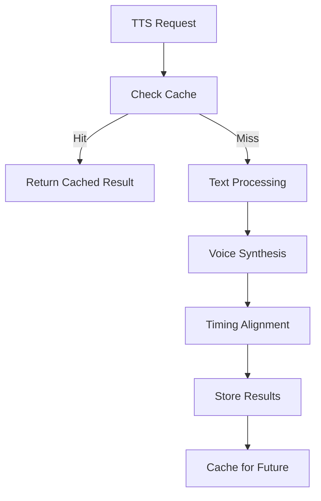

# Voxify Database Design Documentation

## Overview

Voxify uses a **hybrid storage architecture** combining SQLite for structured data and Chroma vector database for embedding storage. This design provides the best of both worlds: ACID compliance for transactional data and high-performance vector storage for voice and text features.

## Architecture Components

### 1. SQLite Relational Database
- **Purpose**: Store structured data, metadata, and relationships
- **Location**: `data/voxify.db`
- **Engine**: SQLite with SQLAlchemy ORM
- **Features**: ACID transactions, foreign key constraints, indexes

### 2. Chroma Vector Database
- **Purpose**: Store vector embeddings and metadata
- **Location**: `data/chroma_db/`
- **Engine**: ChromaDB with DuckDB+Parquet backend
- **Features**: Embedding storage, metadata filtering, collections

## Database Schema

### Core Tables

#### Users Table
Manages user accounts and subscription information.

```sql
CREATE TABLE users (
    id TEXT PRIMARY KEY,                    -- UUID
    email TEXT UNIQUE NOT NULL,
    password_hash TEXT NOT NULL,
    first_name TEXT,                        -- Optional user first name
    last_name TEXT,                         -- Optional user last name
    subscription_type TEXT DEFAULT 'free',  -- free, pro, enterprise
    quota_voice_samples INTEGER DEFAULT 5,
    quota_syntheses_daily INTEGER DEFAULT 100,
    storage_used_bytes INTEGER DEFAULT 0,
    is_active BOOLEAN DEFAULT TRUE,
    created_at TIMESTAMP DEFAULT CURRENT_TIMESTAMP
);
```

**Key Features:**
- UUID primary keys for security
- Subscription-based quotas
- Storage usage tracking
- Soft delete support

#### Voice Samples Table
Stores metadata and embeddings for uploaded voice files and processing status.

```sql
CREATE TABLE voice_samples (
    id TEXT PRIMARY KEY,
    user_id TEXT NOT NULL REFERENCES users(id),
    name TEXT NOT NULL,
    file_path TEXT NOT NULL,
    format TEXT NOT NULL,                  -- wav, mp3, flac
    duration REAL NOT NULL,                -- seconds
    sample_rate INTEGER NOT NULL,          -- Hz
    language TEXT DEFAULT 'en-US',
    quality_score REAL,                    -- 0-10 scale
    status TEXT DEFAULT 'uploaded',        -- uploaded, processing, ready, failed
    voice_embedding_id TEXT,               -- Reference to Chroma
    speaker_embedding_id TEXT,             -- Reference to speaker identity
    created_at TIMESTAMP DEFAULT CURRENT_TIMESTAMP
);
```

**Key Features:**
- Audio format and quality tracking
- Processing status workflow
- Vector database associations

#### Voice Models Table
Tracks trained AI models and their performance metrics.

```sql
CREATE TABLE voice_models (
    id TEXT PRIMARY KEY,
    voice_sample_id TEXT NOT NULL REFERENCES voice_samples(id),
    name TEXT NOT NULL,
    model_path TEXT NOT NULL,
    model_type TEXT DEFAULT 'tacotron2',
    training_status TEXT DEFAULT 'pending',
    training_progress REAL DEFAULT 0.0,
    quality_metrics TEXT,                   -- JSON format
    is_active BOOLEAN DEFAULT TRUE,
    created_at TIMESTAMP DEFAULT CURRENT_TIMESTAMP
);
```

#### Synthesis Jobs Table
Manages TTS synthesis requests and results with detailed timing data.

```sql
CREATE TABLE synthesis_jobs (
    id TEXT PRIMARY KEY,
    user_id TEXT NOT NULL REFERENCES users(id),
    voice_model_id TEXT NOT NULL REFERENCES voice_models(id),
    text_content TEXT NOT NULL,
    text_hash TEXT NOT NULL,               -- For caching
    word_timestamps TEXT,                   -- JSON: [{"word": "hello", "start": 0.0, "end": 0.5}]
    syllable_timestamps TEXT,               -- JSON: [{"syllable": "hel", "start": 0.0, "end": 0.25}]
    phoneme_timestamps TEXT,                -- JSON: [{"phoneme": "h", "start": 0.0, "end": 0.1}]
    config_json TEXT,                       -- JSON: API configuration (include_timestamps, timestamp_granularity, etc.)
    output_format TEXT DEFAULT 'wav',       -- wav, mp3, flac
    sample_rate INTEGER DEFAULT 22050,      -- Hz
    status TEXT DEFAULT 'pending',          -- pending, processing, completed, failed
    progress REAL DEFAULT 0.0,
    estimated_duration INTEGER,             -- seconds
    cache_hit BOOLEAN DEFAULT FALSE,
    created_at TIMESTAMP DEFAULT CURRENT_TIMESTAMP,
    completed_at TIMESTAMP
);
```

**Special Features:**
- **Syllable-to-time mapping**: Project requirement for accurate timing
- **Word-to-time mapping**: Enhanced synthesis control
- **Phoneme alignment**: Detailed linguistic timing data
- **Smart caching**: Avoid reprocessing identical requests
- **API configuration storage**: Store include_timestamps, timestamp_granularity settings
- **Audio format flexibility**: Support wav, mp3, flac output formats

#### Audio Files Table
Manages generated audio files and their metadata.

```sql
CREATE TABLE audio_files (
    id TEXT PRIMARY KEY,                    -- UUID
    synthesis_job_id TEXT NOT NULL REFERENCES synthesis_jobs(id),
    file_path TEXT NOT NULL,               -- Local or cloud storage path
    filename TEXT NOT NULL,                -- Original filename
    format TEXT NOT NULL,                  -- wav, mp3, flac
    file_size INTEGER NOT NULL,            -- bytes
    duration REAL NOT NULL,                -- seconds
    sample_rate INTEGER NOT NULL,          -- Hz
    checksum TEXT,                         -- File integrity check
    is_public BOOLEAN DEFAULT FALSE,       -- Public access flag
    download_count INTEGER DEFAULT 0,      -- Usage tracking
    created_at TIMESTAMP DEFAULT CURRENT_TIMESTAMP,
    expires_at TIMESTAMP,                  -- Auto-cleanup timestamp
    last_accessed_at TIMESTAMP             -- For cleanup policies
);
```

**Key Features:**
- **File lifecycle management**: Automatic cleanup of expired files
- **Integrity verification**: Checksum validation
- **Usage tracking**: Download statistics
- **Access control**: Public/private file access

### Vector Database Collections

#### Voice Embeddings Collection
```python
# One embedding per voice sample is stored here, keyed by voice_sample_id. 
{
    "name": "voice_embeddings",
    "metadata": {
        "embedding_model": "wav2vec2-base-960h",
        "dimension": 768,
        "distance_metric": "cosine"
    }
}
```

## Data Flow and Relationships

### 1. User Registration → Voice Upload → Model Training


### 2. TTS Synthesis Process


## Key Design Decisions

### 1. Hybrid Storage Strategy
**Why SQLite + Vector DB?**
- **SQLite**: ACID compliance, complex queries, relationships
- **Chroma**: High-performance similarity search, scalable embeddings
- **Best of both**: Structured data integrity + ML capabilities

### 2. UUID Primary Keys
**Benefits:**
- Security: No sequential ID enumeration
- Distributed: Generate IDs without coordination
- Cross-system: Consistent across databases

### 3. JSON Field Storage
**Use Cases:**
- Configuration parameters (flexible schema)
- Timing data arrays (complex structures)
- Quality metrics (evolving attributes)


## Performance Optimization

### 1. Database Indexes
```sql
-- Critical indexes for performance
CREATE INDEX idx_voice_samples_user_id ON voice_samples(user_id);
CREATE INDEX idx_voice_samples_status ON voice_samples(status);
CREATE INDEX idx_synthesis_jobs_text_hash ON synthesis_jobs(text_hash);
CREATE INDEX idx_synthesis_jobs_status ON synthesis_jobs(status);
CREATE INDEX idx_synthesis_jobs_user_id ON synthesis_jobs(user_id);
CREATE INDEX idx_audio_files_synthesis_job_id ON audio_files(synthesis_job_id);
CREATE INDEX idx_audio_files_expires_at ON audio_files(expires_at);
CREATE INDEX idx_users_email ON users(email);
```


## Usage Examples

### 1. Basic Setup
```python
from database.models import DatabaseManager, User, VoiceSample
from database.vector_config import ChromaVectorDB

# Initialize databases
db = DatabaseManager("sqlite:///data/voxify.db")
vector_db = ChromaVectorDB("data/chroma_db")

# Create tables
db.create_tables()
db.init_default_data()
```

### 2. User and Voice Sample Handling
```python
# Create user
session = db.get_session()
user = User(
    email="user@example.com",
    password_hash="hashed_password",
    first_name="John",
    last_name="Doe"
)
session.add(user)
session.commit()

# Create voice sample with embedding
voice_sample = VoiceSample(
    user_id=user.id,
    name="My Voice Sample",
    file_path="/uploads/sample.wav",
    duration=15.5,
    format="wav",
    sample_rate=22050
)
session.add(voice_sample)
session.commit()

# Add voice embedding--voice_sample_id must be the primary key generated/set in SQLite for the corresponding sample
vector_db.add_voice_embedding(
    voice_sample_id=voice_sample.id,
    embedding=voice_features,  # 768-dim vector generated by a voice sample encoder 
    metadata={
        "user_id": user.id,
        "language": "en-US",
        "duration": 15.5,
        "quality_score": 8.5
    }
)

# Get voice embedding by id the voice_embeddings collection
voice_embedding = vector_db.get_embedding(voice_sample.id)

# Delete voice embedding by id from the voice_embeddings collection
vector_db.delete_embedding(voice_sample.id)
```

### 3. Similarity Search

# Get full records from SQLite
voice_ids = similar_voices["ids"][0]
voices = session.query(VoiceSample).filter(
    VoiceSample.id.in_(voice_ids)
).all()
```

### 4. TTS Synthesis with Configuration Storage
```python
# Create synthesis job with API configuration
synthesis_job = SynthesisJob(
    user_id=user.id,
    voice_model_id=model_id,
    text_content=text,
    text_hash=generate_text_hash(text),
    config_json=json.dumps({
        "include_timestamps": True,
        "timestamp_granularity": "both",
        "output_format": "wav",
        "sample_rate": 22050,
        "speed": 1.0,
        "pitch": 1.0,
        "volume": 1.0
    }),
    output_format="wav",
    sample_rate=22050,
    status="pending"
)
session.add(synthesis_job)
session.commit()

# After synthesis completion, create audio file record
audio_file = AudioFile(
    synthesis_job_id=synthesis_job.id,
    file_path="/storage/audio/syn_123456.wav",
    filename="synthesis_output.wav",
    format="wav",
    file_size=1048576,
    duration=5.2,
    sample_rate=22050,
    checksum="sha256:abc123...",
    expires_at=datetime.utcnow() + timedelta(days=30)
)
session.add(audio_file)
session.commit()
```

### 5. File Management Operations
```python
# Get file information (for API endpoint /api/v1/files/{file_id}/info)
def get_file_info(file_id):
    audio_file = session.query(AudioFile).filter_by(id=file_id).first()
    if audio_file:
        # Update last accessed timestamp
        audio_file.last_accessed_at = datetime.utcnow()
        session.commit()
        
        return {
            "file_id": audio_file.id,
            "filename": audio_file.filename,
            "content_type": f"audio/{audio_file.format}",
            "size": audio_file.file_size,
            "duration": audio_file.duration,
            "created_at": audio_file.created_at.isoformat(),
            "expires_at": audio_file.expires_at.isoformat() if audio_file.expires_at else None
        }
    return None

# Download audio file (for API endpoint /api/v1/files/audio/{file_id})
def download_audio_file(file_id, user_id):
    audio_file = session.query(AudioFile).join(SynthesisJob).filter(
        AudioFile.id == file_id,
        SynthesisJob.user_id == user_id  # Ensure user owns the file
    ).first()
    
    if audio_file:
        # Increment download counter
        audio_file.download_count += 1
        audio_file.last_accessed_at = datetime.utcnow()
        session.commit()
        
        return audio_file.file_path
    return None
```


## Security Considerations

### 1. Data Isolation
- User data strictly partitioned by user_id
- Vector searches filtered by ownership
- No cross-user data leakage

### 2. Input Validation
- File size and format validation
- Text length limits for synthesis
- SQL injection prevention via ORM

### 3. Privacy Protection
- Optional public/private voice samples
- Secure file storage paths
- Audit trails for data access


### Common Issues

1. **Vector DB Connection Errors**
   - Check ChromaDB service status
   - Verify disk space availability
   - Restart with `vector_db.close()` and reconnect

2. **SQLite Locking Issues**
   - Use connection pooling
   - Enable WAL mode: `PRAGMA journal_mode=WAL`
   - Check for long-running transactions

3. **Performance Degradation**
   - Analyze query plans with `EXPLAIN QUERY PLAN`
   - Rebuild indexes: `REINDEX`
   - Monitor vector collection sizes

### Debug Mode
```python
# Enable SQL debugging
DatabaseManager("sqlite:///data/voxify.db", echo=True)

# Vector search debugging
vector_db.client.get_collection().peek(limit=5) # taking a peek at the collection: returns how many specified or just the first 10
```

## Future Enhancements

### 1. Scalability Improvements
- Implement database sharding for large datasets
- Add read replicas for query performance
- Consider migration to distributed vector databases

### 2. Advanced Features
- Real-time voice similarity alerts
- Cross-language voice matching
- Automated quality assessment pipelines

### 3. Analytics Integration
- Time-series data for usage patterns
- Machine learning model performance tracking
- Predictive scaling based on demand patterns

---

