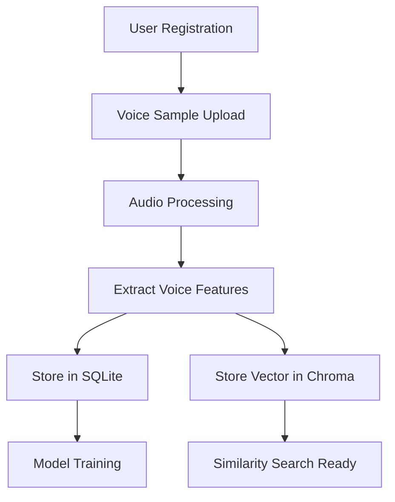
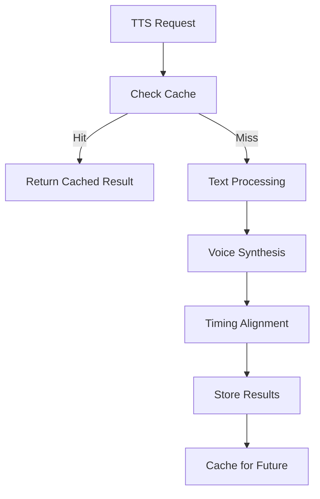

# Voxify Database Design Documentation

## Overview

Voxify uses a **hybrid storage architecture** combining SQLite for structured data and Chroma vector database for embeddings and similarity search. This design provides the best of both worlds: ACID compliance for transactional data and high-performance similarity search for voice and text features.

## Architecture Components

### 1. SQLite Relational Database
- **Purpose**: Store structured data, metadata, and relationships
- **Location**: `data/voxify.db`
- **Engine**: SQLite with SQLAlchemy ORM
- **Features**: ACID transactions, foreign key constraints, indexes

### 2. Chroma Vector Database
- **Purpose**: Store embeddings for similarity search
- **Location**: `data/chroma_db/`
- **Engine**: ChromaDB with DuckDB+Parquet backend
- **Features**: Vector similarity search, metadata filtering, collections

## Database Schema

### Core Tables

#### Users Table
Manages user accounts and subscription information.

```sql
CREATE TABLE users (
    id TEXT PRIMARY KEY,                    -- UUID
    email TEXT UNIQUE NOT NULL,
    password_hash TEXT NOT NULL,
    subscription_type TEXT DEFAULT 'free',  -- free, pro, enterprise
    quota_voice_samples INTEGER DEFAULT 5,
    quota_syntheses_daily INTEGER DEFAULT 100,
    storage_used_bytes INTEGER DEFAULT 0,
    is_active BOOLEAN DEFAULT TRUE,
    created_at TIMESTAMP DEFAULT CURRENT_TIMESTAMP
);
```

**Key Features:**
- UUID primary keys for security
- Subscription-based quotas
- Storage usage tracking
- Soft delete support

#### Voice Samples Table
Stores metadata for uploaded voice files and processing status.

```sql
CREATE TABLE voice_samples (
    id TEXT PRIMARY KEY,
    user_id TEXT NOT NULL REFERENCES users(id),
    name TEXT NOT NULL,
    file_path TEXT NOT NULL,
    format TEXT NOT NULL,                  -- wav, mp3, flac
    duration REAL NOT NULL,                -- seconds
    sample_rate INTEGER NOT NULL,          -- Hz
    language TEXT DEFAULT 'en-US',
    quality_score REAL,                    -- 0-10 scale
    status TEXT DEFAULT 'uploaded',        -- uploaded, processing, ready, failed
    voice_embedding_id TEXT,               -- Reference to Chroma
    speaker_embedding_id TEXT,             -- Reference to speaker identity
    created_at TIMESTAMP DEFAULT CURRENT_TIMESTAMP
);
```

**Key Features:**
- Audio format and quality tracking
- Processing status workflow
- Vector database associations
- Automatic quality assessment

#### Voice Models Table
Tracks trained AI models and their performance metrics.

```sql
CREATE TABLE voice_models (
    id TEXT PRIMARY KEY,
    voice_sample_id TEXT NOT NULL REFERENCES voice_samples(id),
    name TEXT NOT NULL,
    model_path TEXT NOT NULL,
    model_type TEXT DEFAULT 'tacotron2',
    training_status TEXT DEFAULT 'pending',
    training_progress REAL DEFAULT 0.0,
    quality_metrics TEXT,                   -- JSON format
    is_active BOOLEAN DEFAULT TRUE,
    created_at TIMESTAMP DEFAULT CURRENT_TIMESTAMP
);
```

#### Synthesis Jobs Table
Manages TTS synthesis requests and results with detailed timing data.

```sql
CREATE TABLE synthesis_jobs (
    id TEXT PRIMARY KEY,
    user_id TEXT NOT NULL REFERENCES users(id),
    voice_model_id TEXT NOT NULL REFERENCES voice_models(id),
    text_content TEXT NOT NULL,
    text_hash TEXT NOT NULL,               -- For caching
    word_timestamps TEXT,                   -- JSON: [{"word": "hello", "start": 0.0, "end": 0.5}]
    syllable_timestamps TEXT,               -- JSON: [{"syllable": "hel", "start": 0.0, "end": 0.25}]
    phoneme_timestamps TEXT,                -- JSON: [{"phoneme": "h", "start": 0.0, "end": 0.1}]
    status TEXT DEFAULT 'pending',
    progress REAL DEFAULT 0.0,
    cache_hit BOOLEAN DEFAULT FALSE,
    created_at TIMESTAMP DEFAULT CURRENT_TIMESTAMP
);
```

**Special Features:**
- **Syllable-to-time mapping**: Project requirement for accurate timing
- **Word-to-time mapping**: Enhanced synthesis control
- **Phoneme alignment**: Detailed linguistic timing data
- **Smart caching**: Avoid reprocessing identical requests

### Vector Database Collections

#### Voice Embeddings Collection
```python
{
    "name": "voice_embeddings",
    "metadata": {
        "embedding_model": "wav2vec2-base-960h",
        "dimension": 768,
        "distance_metric": "cosine"
    }
}
```

**Document Structure:**
```python
{
    "id": "voice_sample_uuid",
    "embedding": [768-dimensional vector],
    "metadata": {
        "user_id": "user_uuid",
        "language": "en-US",
        "duration": 15.5,
        "quality_score": 8.2,
        "gender": "female",
        "age_group": "adult"
    }
}
```

#### Speaker Embeddings Collection
```python
{
    "name": "speaker_embeddings",
    "metadata": {
        "embedding_model": "resemblyzer",
        "dimension": 256,
        "distance_metric": "cosine"
    }
}
```

#### Text Embeddings Collection
```python
{
    "name": "text_embeddings",
    "metadata": {
        "embedding_model": "sentence-transformers/all-MiniLM-L6-v2",
        "dimension": 384,
        "distance_metric": "cosine"
    }
}
```

## Data Flow and Relationships

### 1. User Registration → Voice Upload → Model Training


### 2. TTS Synthesis Process


## Key Design Decisions

### 1. Hybrid Storage Strategy
**Why SQLite + Vector DB?**
- **SQLite**: ACID compliance, complex queries, relationships
- **Chroma**: High-performance similarity search, scalable embeddings
- **Best of both**: Structured data integrity + ML capabilities

### 2. UUID Primary Keys
**Benefits:**
- Security: No sequential ID enumeration
- Distributed: Generate IDs without coordination
- Cross-system: Consistent across databases

### 3. JSON Field Storage
**Use Cases:**
- Configuration parameters (flexible schema)
- Timing data arrays (complex structures)
- Quality metrics (evolving attributes)

### 4. Caching Strategy
**Multi-level Caching:**
- **Text Similarity**: Find similar synthesis requests
- **File Caching**: Store generated audio files
- **Metadata Caching**: Performance metrics and settings

## Performance Optimization

### 1. Database Indexes
```sql
-- Critical indexes for performance
CREATE INDEX idx_voice_samples_user_id ON voice_samples(user_id);
CREATE INDEX idx_voice_samples_status ON voice_samples(status);
CREATE INDEX idx_synthesis_jobs_text_hash ON synthesis_jobs(text_hash);
CREATE INDEX idx_synthesis_jobs_status ON synthesis_jobs(status);
```

### 2. Vector Search Optimization
```python
# Optimized similarity search with filtering
results = collection.query(
    query_embeddings=[embedding],
    n_results=10,
    where={"user_id": user_id, "language": "en-US"},
    include=["metadatas", "distances"]
)
```

### 3. Batch Operations
```python
# Batch insert for better performance
collection.add(
    ids=batch_ids,
    embeddings=batch_embeddings,
    metadatas=batch_metadata
)
```

## Usage Examples

### 1. Basic Setup
```python
from database.models import DatabaseManager, User, VoiceSample
from database.vector_config import ChromaVectorDB

# Initialize databases
db = DatabaseManager("sqlite:///data/voxify.db")
vector_db = ChromaVectorDB("data/chroma_db")

# Create tables
db.create_tables()
db.init_default_data()
```

### 2. User and Voice Sample Creation
```python
# Create user
session = db.get_session()
user = User(
    email="user@example.com",
    password_hash="hashed_password",
    first_name="John",
    last_name="Doe"
)
session.add(user)
session.commit()

# Create voice sample with embedding
voice_sample = VoiceSample(
    user_id=user.id,
    name="My Voice Sample",
    file_path="/uploads/sample.wav",
    duration=15.5,
    format="wav",
    sample_rate=22050
)
session.add(voice_sample)
session.commit()

# Add voice embedding
vector_db.add_voice_embedding(
    voice_sample_id=voice_sample.id,
    embedding=voice_features,  # 768-dim vector
    metadata={
        "user_id": user.id,
        "language": "en-US",
        "duration": 15.5,
        "quality_score": 8.5
    }
)
```

### 3. Similarity Search
```python
# Find similar voices
similar_voices = vector_db.search_similar_voices(
    query_embedding=query_vector,
    user_id=user.id,
    language="en-US",
    min_quality=7.0,
    top_k=5
)

# Get full records from SQLite
voice_ids = similar_voices["ids"][0]
voices = session.query(VoiceSample).filter(
    VoiceSample.id.in_(voice_ids)
).all()
```

### 4. TTS with Caching
```python
# Check for cached synthesis
cached = vector_db.search_similar_texts(
    query_embedding=text_embedding,
    voice_model_id=model_id,
    similarity_threshold=0.95
)

if cached["ids"][0]:
    # Use cached result
    return get_cached_audio(cached["ids"][0][0])
else:
    # Perform new synthesis
    result = synthesize_speech(text, model_id)
    cache_result(result, text_embedding)
    return result
```

## Security Considerations

### 1. Data Isolation
- User data strictly partitioned by user_id
- Vector searches filtered by ownership
- No cross-user data leakage

### 2. Input Validation
- File size and format validation
- Text length limits for synthesis
- SQL injection prevention via ORM

### 3. Privacy Protection
- Optional public/private voice samples
- Secure file storage paths
- Audit trails for data access

## Monitoring and Maintenance

### 1. Database Health Checks
```python
# Check database integrity
def health_check():
    return {
        "sqlite_connection": test_sqlite_connection(),
        "vector_db_connection": test_vector_connection(),
        "disk_usage": get_disk_usage(),
        "cache_hit_rate": calculate_cache_hit_rate()
    }
```

### 2. Cleanup Procedures
```python
# Regular maintenance tasks
def cleanup_old_data():
    # Remove expired cache entries
    vector_db.cleanup_expired_cache(days_old=30)
    
    # Archive completed synthesis jobs
    archive_old_synthesis_jobs(days_old=90)
    
    # Optimize database
    db.engine.execute("VACUUM")
```

### 3. Backup Strategy
```bash
# SQLite backup
sqlite3 data/voxify.db ".backup backup/voxify_$(date +%Y%m%d).db"

# Chroma backup
tar -czf backup/chroma_$(date +%Y%m%d).tar.gz data/chroma_db/
```

## Migration and Versioning

### 1. Schema Versioning
```sql
-- Track schema versions
CREATE TABLE schema_version (
    version TEXT PRIMARY KEY,
    applied_at TIMESTAMP DEFAULT CURRENT_TIMESTAMP,
    description TEXT
);
```

### 2. Migration Scripts
```python
def migrate_to_v1_1():
    """Add gender detection fields"""
    db.engine.execute("""
        ALTER TABLE voice_samples 
        ADD COLUMN gender TEXT,
        ADD COLUMN age_group TEXT,
        ADD COLUMN accent TEXT
    """)
    
    # Update schema version
    session.add(SchemaVersion(
        version="1.1.0",
        description="Added demographic detection fields"
    ))
    session.commit()
```

## Troubleshooting

### Common Issues

1. **Vector DB Connection Errors**
   - Check ChromaDB service status
   - Verify disk space availability
   - Restart with `vector_db.close()` and reconnect

2. **SQLite Locking Issues**
   - Use connection pooling
   - Enable WAL mode: `PRAGMA journal_mode=WAL`
   - Check for long-running transactions

3. **Performance Degradation**
   - Analyze query plans with `EXPLAIN QUERY PLAN`
   - Rebuild indexes: `REINDEX`
   - Monitor vector collection sizes

### Debug Mode
```python
# Enable SQL debugging
DatabaseManager("sqlite:///data/voxify.db", echo=True)

# Vector search debugging
vector_db.client.get_collection("voice_embeddings").peek()
```

## Future Enhancements

### 1. Scalability Improvements
- Implement database sharding for large datasets
- Add read replicas for query performance
- Consider migration to distributed vector databases

### 2. Advanced Features
- Real-time voice similarity alerts
- Cross-language voice matching
- Automated quality assessment pipelines

### 3. Analytics Integration
- Time-series data for usage patterns
- Machine learning model performance tracking
- Predictive scaling based on demand patterns

---

